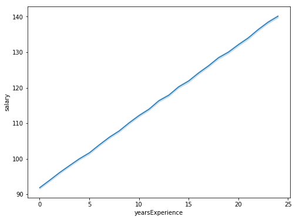

# Salary prediction using job descriptions
## Introduction
According to the survey done by Techwire found [here](https://www.wraltechwire.com/2019/03/27/were-very-underpaid-say-56-of-tech-workers-in-survey/) 56% of the US employees think that they are underpaid. Predicting salary of an employee is an importanat aspect for business's HR and talent function. The aim of this project is to build a predictive analysis application in python that can be used to predict the salaries of an employee. The Human Resource as well as Talent Acquisition department can use this modeling to predict salaries of the employee. All the job seeking professionals can put these application in use while job seeking.

## Goal
The analysis is aimed to outcome every step in the process of predicting salary of an employee from loading data and performing EDA to deploy and automate pipeline by builduing machine learning models. All the process below are depicted one by one

## Data Collection
The data that I used in this project can be found in the data [folder](https://github.com/moni2096/Salary-prediction-through-job-descriptions/tree/master/data).The analysis is carried out on 112 mb dataset which consists of features mentioned below:
**jobID**: The specific Id assigned to each role.

**companyID**: The specific Id assigned to company in each categories.

**degree**: The degree which applicant possess while applying for a particular job or woking at a particular role in a company.

**major**: Major related to the degrees possessed by the applicant.

**industry**: Industry that given individual works in.

**yearsOfExperience**: The number of years of experience that an applicant possess.

**milesFromMetropolis** : Distance of the location from the Metropolis.

**salary** : Salary of the job. The values are given in 1000s of the actual value.

## Data Preprocessing
The data was clean mostly. I tried to explore and check for null and duplicate values and droppped them. Also, I dropped the column jobID because it was not relevant with the target variable.

## Exploratory Data Analysis
This process is heart of any data science project. It usually helps to gain valuable insights from the data which you can further leverage while builduing your model. Some of the processes that I applied to data are mentione below:

 **Checking for Outlier using Inter Quartile Range**

 **Determining length and data Types to summarize categorical and numerical features**
 
 **Visualizing target variables**
 
 **Builduing heatmap to check co-relation between various features** 
 
 **Supporting analysis of heatmap by visualizing features with highest correlation with target variable**
 
Below are some of the images from EDA. The first one is of the heatmap while the other two are of the features that change the most with target variables.

The outcome of EDA was that MilesFromMetropolis and YearsOfExperience are the two most important feature that can help us predict the target variable Salary.
 
## Guidelines

**Notebook_1**: Notebook 1 is the Exploratory Data Analysis and Data Preprocessing Process. [Check here](https://github.com/moni2096/Salary-prediction-through-job-descriptions/blob/master/1_Define_EDA.ipynb)

**Notebook_2**: Notebook 2 is the Data Modeling Process and Hypothesizing solutions and testing them on 20% test set by establishing a baseline. [Check here](https://github.com/moni2096/Salary-prediction-through-job-descriptions/blob/master/2_Data_Modeling.ipynb)

**Notebook_3**: Notebook 3 is about showing approach with Object Oriented programing and writing reusbale code. [Check here](https://github.com/moni2096/Salary-prediction-through-job-descriptions/blob/master/3_Predictive_Modeling%26Pipeline.ipynb)

## Modeling

Based on the Exploratory Data Analysis process I chose categorical and numerical features to feed my model. The Baseline Model Liner Regression was with MSE 384.87 on test set.

| Model                     | Mean Squared Error|
|---------------------------|---------------
| Linear Regression         | 384.87       |
| Random Forest Regressor   | 367.50       |
| Gradient Boosting Regressor | 357.17     |

Gradient Boosting Regressor clearly provides best output so I used it to predict salaries on the entire data. The predictions are stored in the prediction.csv and final deployed model configuration are stored in model.txt. The feature importance graph is shown below and the results are stores in feature_importances.csv.

## Conclusion
The key takeaway from this modeling project is that Job Type, Miles from Metropolis and Years of Experience are the most important features to predict salaries of the employee. This outcome can be supported with the assumption true in general. Future iterations of this project can be applied to human resource data of many companies which makes it more clear that the above mentioned three factors are really important to decide salary of the person in general.
